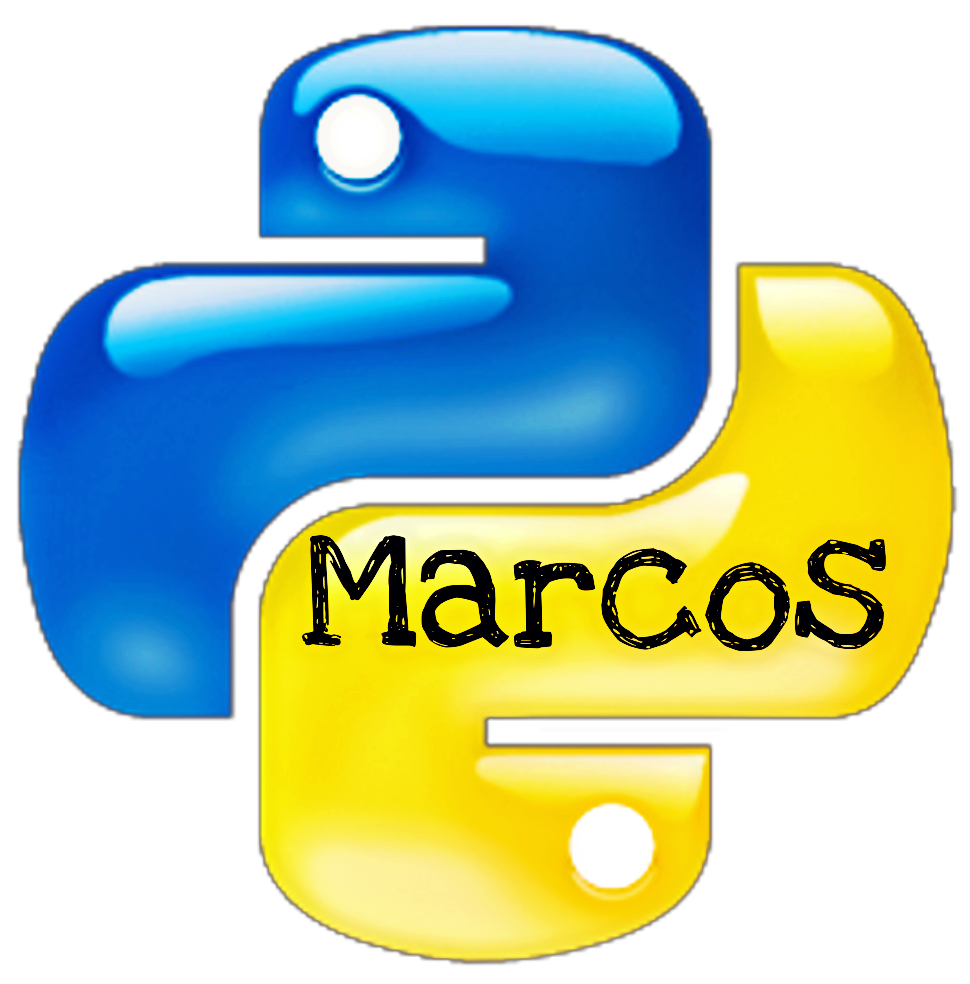

# Python For Biology

This repository contains the material from Python for Biologist Course

## Join the community:

<a href="https://t.me/PythonBiologos" target="_blank"> <!-- when clicked it'll open the website in a new page -->
   <!-- this is your icon, if not loaded it'll just render Black Icon as text -->
</a>

## Course Outline:

1. Introduction and variables
2. Functions
3. Conditionals
4. Loops
5. Sets and Dictionaries
6. Exceptions
7. Libraries
8. Etc.

## Projects

1. Neuron Simulation (Hindmarsh–Rose Model)
2. Find the Subsequence (finite automata)
3. Growth models
4. (EXTRA) Biological Networks 
